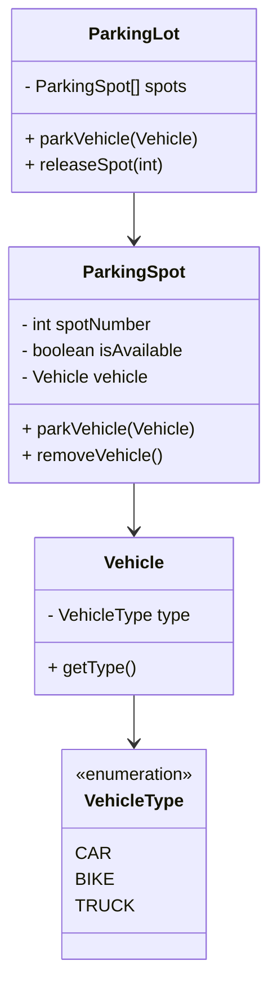

# Smart Parking System

## 📋 Overview
This project simulates a Smart Parking System that handles vehicle parking based on vehicle type and availability of parking spots. It demonstrates basic Object-Oriented Programming (OOP) principles using Java.

---

## ⚙️ Setup Instructions

1. **Install Java**  
   Ensure Java Development Kit (JDK) version **17 or later** is installed. You can check your version using:
   ```bash
   java -version
   ```

2. **Clone or Download** the repository and navigate to the directory:
   ```bash
   cd smartparking
   ```

3. **Compile the Code** (only needed if source `.java` files are present):
   ```bash
   javac *.java
   ```

4. **Run the Application**:
   ```bash
   java Main
   ```

> ⚠️ Note: If only `.class` files are provided (as in this version), just run the app using `java Main`.

---

## ✅ Prerequisites

- Java JDK 17+
- Terminal/Command Line Access
- Optional: IDE like IntelliJ IDEA or Eclipse for easier viewing/editing

---

## 🚘 Sample Usage

Upon running the program:
- It initializes a parking lot.
- You can observe various vehicle entries and allocation of parking spots.
- It handles different types of vehicles such as car , Bus , Motorcycle , electric_car.

Expected output may look like:
```
Vehicle of type MOTORCYCLE parked at Spot 1
Vehicle of type CAR parked at Spot 3
```

---

## 🧱 Project Structure

```
smartparking/
│
├── Main.class              # Entry point for the application
├── ParkingLot.class        # Manages overall parking logic
├── ParkingLot$1.class      # Anonymous class or inner class
├── ParkingSpot.class       # Represents individual parking spots
├── Vehicle.class           # Base class for vehicles
└── VehicleType.class       # Enum for CAR, BIKE, TRUCK types
```

---

## 📊 Class Diagram



---

## 📌 Notes
- This README is based on compiled `.class` files. If you need source `.java` files or want to enhance it, consider decompiling or requesting the original source code.
